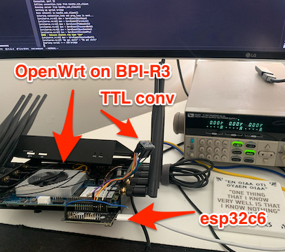
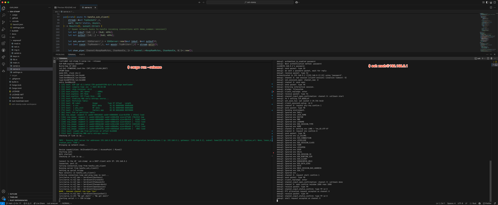
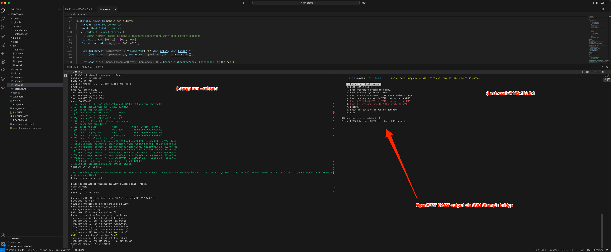

<!--
SPDX-FileCopyrightText: 2025 Roman Valls, 2025

SPDX-License-Identifier: GPL-3.0-or-later
-->

# SSH Stamp

Sponsored by:

![nlnet_zero_commons][nlnet_zero_commons]

# ⚠️ WARNING: Pre-alpha PoC quality, DO NOT use in production. Currently contains highly unsafe business logic auth issues (both password and key management handlers need to be fixed). 

# ⚠️ WARNING: Do not file CVEs reports since deficiencies are very much known at this point in time and they'll be worked on soon as part of [this NLNet SSH-Stamp research and development grant][nlnet-grant] ;)

Expect panics, lost bytes on the UART and other tricky UX issues, we are working on it, pull-requests are accepted too!

## Description

Your everyday SSH secured serial access.

The **SSH Stamp** is a secure wireless to UART bridge
implemented in Rust (no_std, no_alloc and no_unsafe whenever possible)
with simplicity and robustness as its main design tenets.

The firmware runs on a microcontroller running Secure SHell Protocol
(RFC 4253 and related IETF standards series). This firmware can be
used for multiple purposes, conveniently avoiding physical
tethering and securely tunneling traffic via SSH by default: easily
add telemetry to a (moving) robot, monitor and operate any (domestic)
appliance remotely, conduct remote cybersecurity audits on
network gear of a company, reverse engineer hardware and software for
right to repair purposes, just to name a few examples.

A "low level to SSH Swiss army knife".

# Building

Rust versions are controlled via `rust-toolchain.toml` and the equivalent defined on the CI workflow.

On a fresh system the following should be enough to build and run on the relevant ESP32 dev boards.

## Required for all targets:
```
rustup toolchain install stable --component rust-src
cargo install espflash
```

## ESP32-C6


```
rustup target add riscv32imac-unknown-none-elf
cargo build-esp32c6
cargo run-esp32c6
```

## ESP32-C2 / ESP32-C3
```
rustup target add riscv32imc-unknown-none-elf`
```
### ESP32-C2
```
cargo build-esp32c2
cargo run-esp32c2
```
### ESP32-C3
```
cargo build-esp32c2
cargo run-esp32c3
```


## ESP32 / ESP32-S2 / ESP32-S3 (Xtensa Cores)
Install esp toolchain first: https://github.com/esp-rs/espup
```
cargo install espup                                      
espup install                                            
source $HOME/export-esp.sh                                                         
```

### ESP32
```
cargo +esp build-esp32
cargo +esp run-esp32
```
### ESP32-S2
```
cargo +esp build-esp32s2
cargo +esp run-esp32s2
```
### ESP32-S3
```
cargo +esp build-esp32s3
cargo +esp run-esp32s3
```

### Using rustup toolchain override (Doesn't require `+esp`)
To set rustup override:
```
rustup override set esp   
```
To remove rustup override:
```
cargo override unset
```
Build:
```
cargo build-esp32
cargo build-esp32s2
cargo build-esp32s3
```
Run:
```
cargo run-esp32
cargo run-esp32s2
cargo run-esp32s3
```


# Default UART Pins
| Target  | RX | TX | 
| ----    | -- | -- |
| ESP32   | 13 | 14 | 
| ESP32S2 | 11 | 10 | 
| ESP32C2 |  9 | 10 |
| ESP32C3 | 20 | 21 |
| ESP32C6 | 11 | 10 |

# Example usecases

The following depicts a typical OpenWrt router with a (prototype) SSH Stamp connected to its UART. After ssh-ing into the SSH Stamp, one can interact with the router's UART "off band", to i.e:

1. Recover from OpenWrt not booting without needing to open up the case and connect a wired TTL2USB converter. A simple SSH-based <acronym title="Board Management Controller">BMC</acronym>.
2. Capture kernel panics during your router's (ab)normal operation. I.e: [to debug a buggy wireless driver][openwrt_mediatek_no_monitor].
3. Re-provision the whole OpenWrt installation without having to physically unmount the device from its place, all from your wireless SSH shell comfort.

Here are some PoC shots:





# Generate SBOM

```
cargo install cargo-cyclonedx
cargo cyclonedx -f json --manifest-path ./docs/
```

[nlnet-grant]: https://nlnet.nl/project/SSH-Stamp/
[openwrt_mediatek_no_monitor]: https://github.com/openwrt/openwrt/issues/16279
[nlnet_zero_commons]: ./docs/nlnet/zero_commons_logo.svg

/dev/ttyUSB0 is ESP32

USB to UART
sudo minicom --device /dev/ttyUSB1


https://docs.espressif.com/projects/esp-matter/en/latest/esp32/optimizations.html
