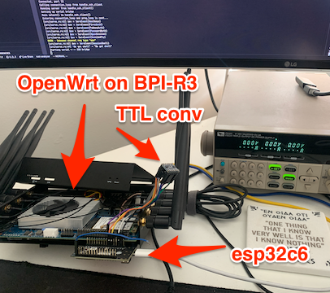
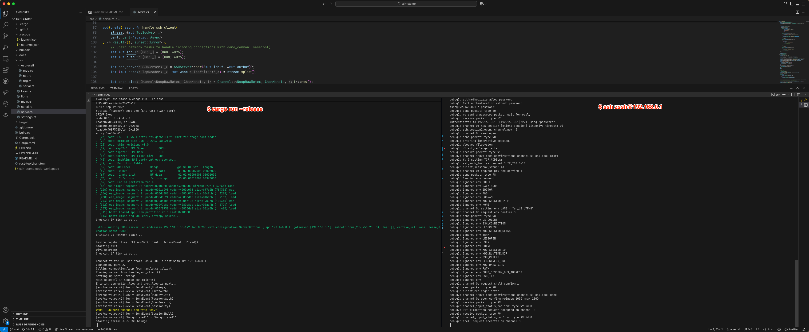
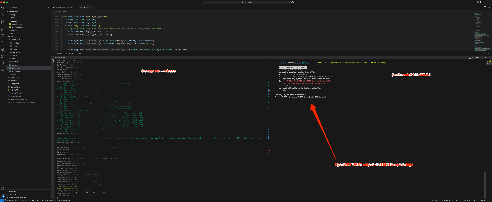

<!--
SPDX-FileCopyrightText: 2026 Roman Valls Guimera <brainstorm@nopcode.org>
SPDX-FileCopyrightText: 2026 Julio Beltran Ortega <jubeormk1@gmail.com>
SPDX-FileCopyrightText: 2026 Angus Gratton <gus@projectgus.com>
SPDX-FileCopyrightText: 2026 Anthony Tambasco <anthony.tambasco@fastmail.com>

SPDX-License-Identifier: GPL-3.0-or-later
-->

[](https://api.reuse.software/info/github.com/brainstorm/ssh-stamp)

# SSH Stamp

Your everyday SSH secured serial access.

## Description

The **SSH Stamp** is a secure wireless to UART bridge implemented in Rust (no_std, no_alloc and no_unsafe whenever possible) with simplicity and robustness as its main design tenets.

The firmware runs on a microcontroller running Secure SHell Protocol (RFC 4253 and related IETF standards series). This firmware can be used for multiple purposes, conveniently avoiding physical tethering and securely tunneling traffic via SSH by default: easily add telemetry to a (moving) robot, monitor and operate any (domestic) appliance remotely, conduct remote cybersecurity audits on network gear of a company, reverse engineer hardware and software for right to repair purposes, just to name a few examples.

A "low level to SSH Swiss army knife".

# Building

Tooling is controlled by `rust-toolchain.toml`. On a fresh host you'll typically need the Rust source component and a flasher (we use `espflash` below as an example):

```
rustup toolchain install stable --component rust-src
cargo install espflash --locked
```

Build/flash for your board using the short command pattern (replace `<target>` with the concrete chip you have):

| Machine target | Rust toolchain target |
| --- | --- |
| `esp32` | `xtensa-esp32-none-elf` |
| `esp32c2` | `riscv32imc-unknown-none-elf` |
| `esp32c3` | `riscv32imc-unknown-none-elf` |
| `esp32c6` | `riscv32imac-unknown-none-elf` |
| `esp32s2` | `xtensa-esp32s2-none-elf` |
| `esp32s3` | `xtensa-esp32s3-none-elf` |

<!--| `esp32c61` | `riscv32imac-unknown-none-elf` |-->
<!--| `esp32c5` | `riscv32imac-unknown-none-elf` |-->

```
rustup target add <rust-toolchain-target>
cargo build-<machine-target>     # e.g. cargo build-esp32c6, cargo build-esp32c3, cargo build-esp32
cargo run-<machine-target>       # convenience helper (if supported) that builds + flashes
```

Xtensa targets (ESP32/ESP32-S2/S3) do require `espup` in addition to the `rustup` command above:

```
cargo install espup
espup install
source $HOME/export-esp.sh
```

## First boot & provisioning

1. Flash the firmware and open the serial console (example):

```
# build & flash (example for esp32c6)
cargo build-esp32c6 --release
cargo run-esp32c6
```

1. On first boot the device generates a random WPA2 PSK and prints it to the serial console with the following (or similar) info messages:

```
(...)
INFO - WIFI PSK: <PSK>
INFO - WIFI MAC: <MAC>
INFO - SSH hostkey fingerprint: <FINGERPRINT>
INFO - Connect to the AP `<RANDOM AP NAME>` as a DHCP client with IP: 192.168.4.1
```

2. Connect a laptop/phone to the WiFi AP using the printed SSID and PSK, then SSH into the device at `root@192.168.4.1`.

3. Provisioning via SSH environment variables

You can provision the device by sending these environment variables with your SSH client. Examples below use OpenSSH and `SendEnv` to forward local environment variables to the device.

- Add your public key (first-boot only):

```
export SSH_STAMP_PUBKEY="$(cat ~/.ssh/id_ed25519.pub)"
ssh -o SendEnv=SSH_STAMP_PUBKEY root@192.168.4.1
```

- Set a custom SSID and WPA2 PSK (allowed on first-boot or any authenticated session):

```
export SSH_STAMP_WIFI_AP_SSID="SshStampSSID"
export SSH_STAMP_WIFI_AP_PSK="my-super-secret-psk"
ssh -o SendEnv=SSH_STAMP_WIFI_AP_SSID -o SendEnv=SSH_STAMP_WIFI_AP_PSK root@192.168.4.1
```

- To connect the SSH Stamp to an existing access point with DHCP (Station Mode):
```
export SSH_STAMP_WIFI_STA_SSID="MyHomeSSID"
export SSH_STAMP_WIFI_STA_PSK="my-super-secret-psk"
ssh -o SendEnv=SSH_STAMP_WIFI_STA_SSID -o SendEnv=SSH_STAMP_WIFI_STA_PSK root@192.168.4.1
```

- To return to the default Access Point mode, clear the Station SSID:
```
export SSH_STAMP_WIFI_STA_SSID=""
ssh -o SendEnv=SSH_STAMP_WIFI_STA_SSID root@192.168.4.1
```

Notes:
- `SSH_STAMP_PUBKEY` is accepted on first-boot to add the initial admin key.
- `SSH_STAMP_WIFI_AP_SSID` and `SSH_STAMP_WIFI_AP_PSK` may be applied while authenticated via pubkey (or on first-boot). After a successful change the device persists the settings and performs a software reset so the new WiFi settings take effect.
- If you prefer a single-step provisioning, export all three env vars locally and forward them with `SendEnv` in the same SSH invocation.

If your SSH client doesn't forward environment variables by default, use the `-o SendEnv=VAR` option as shown above or configure `SendEnv` in your SSH client config.

# UART pins

UART RX/TX pins are defined per-board in the `ssh-stamp-esp32-boards` crate.
Each board feature (e.g. `board-esp32c6-devkitc`) selects a specific PCB and
its pin assignments. The `Board` trait is the single source of truth — no
other file in the repository hard-codes UART pin numbers.

Supported boards:

| Board feature            | IC        | UART RX | UART TX | Board                                                                              |
|--------------------------|-----------|---------|---------|------------------------------------------------------------------------------------|
| `board-esp32c6-devkitc`  | ESP32-C6  | 10      | 11      | [ESP32-C6-DevKitC-1](https://docs.espressif.com/projects/esp-dev-kits/en/latest/esp32c6/esp32-c6-devkitc-1/index.html) |
| `board-esp32c6-generic`  | ESP32-C6  | 10      | 11      | Generic ESP32-C6 board                                                              |
| `board-esp32-s2-saola`   | ESP32-S2  | 10      | 11      | [ESP32-S2-Saola-1](https://docs.espressif.com/projects/esp-dev-kits/en/latest/esp32s2/esp32-s2-saola-1/index.html) |

To see the full list with links, run:

```
cargo build-doc
```

Then open `target/riscv32imac-unknown-none-elf/doc/ssh_stamp_esp32_boards/index.html`,
which contains the per-board pin assignment table.

# Example usecases

The following depicts a typical OpenWrt router with a (prototype) SSH Stamp connected to its UART. After ssh-ing into the SSH Stamp, one can interact with the router's UART "off band", to i.e:

1. Recover from OpenWrt not booting without needing to open up the case and connect a wired TTL2USB converter. A simple SSH-based <acronym title="Board Management Controller">BMC</acronym>.
2. Capture kernel panics during your router's (ab)normal operation. I.e: [to debug a buggy wireless driver][openwrt_mediatek_no_monitor].
3. Re-provision the whole OpenWrt installation without having to physically unmount the device from its place, all from your wireless SSH shell comfort.

Here are some PoC shots:





Sponsored by:

![nlnet_zero_commons][nlnet_zero_commons]

[nlnet-grant]: https://nlnet.nl/project/SSH-Stamp/
[openwrt_mediatek_no_monitor]: https://github.com/openwrt/openwrt/issues/16279
[nlnet_zero_commons]: ./docs/nlnet/zero_commons_logo.svg
