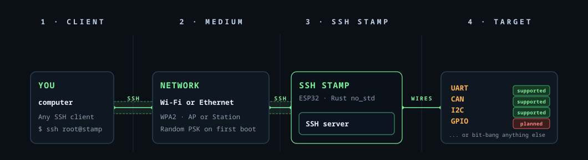

<!--
SPDX-FileCopyrightText: 2026 Roman Valls Guimera <brainstorm@nopcode.org>
SPDX-FileCopyrightText: 2026 Julio Beltran Ortega <jubeormk1@gmail.com>
SPDX-FileCopyrightText: 2026 Angus Gratton <gus@projectgus.com>
SPDX-FileCopyrightText: 2026 Anthony Tambasco <anthony.tambasco@fastmail.com>

SPDX-License-Identifier: GPL-3.0-or-later
-->

# SSH Stamp

SSH-stamp is a bridge that connects SSH with well known electrical protocols such as UART, I2C, CAN, etc...

It replaces traditional serial cables (a.k.a USB2TTL converters) with encrypted SSH access for debugging, automation, telemetry, and embedded development. 

The SSH connection can be established via WiFi, enabling untethered (and secure) access to, for instance, moving robots.

## Using

Refer to [building](./docs/BUILDING.md) if you are not using our binary releases and [using](./docs/USING.md) documentation.

## Targets

At present only Espressif ICs are supported but other targets (i.e Raspberry Pico2 or Dabao-1x) are planned in the future.

## Acknowledgement

This project was funded through the NGI0 Commons Fund, a fund established by NLnet with financial support from the European Commission's Next Generation Internet programme, under the aegis of DG Communications Networks, Content and Technology under grant agreement No 101135429.

[nlnet-grant]: https://nlnet.nl/project/SSH-Stamp/