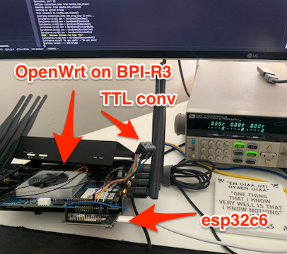
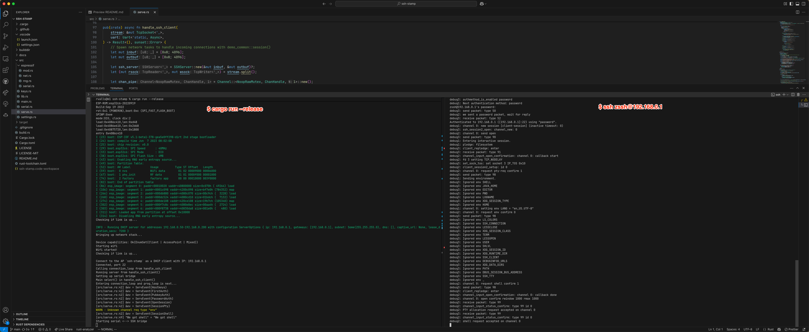
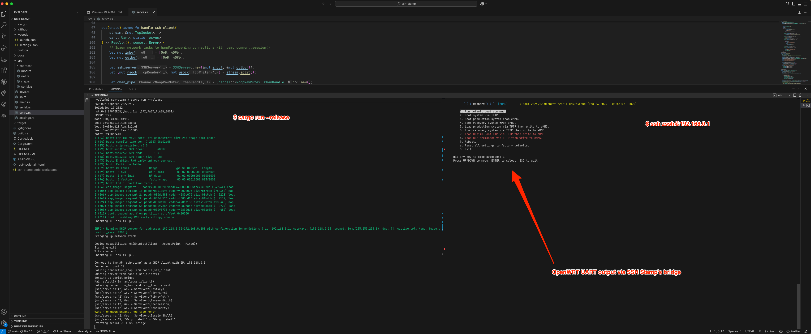

# Example usecases

The following depicts a typical OpenWrt router with a (prototype) SSH Stamp connected to its UART. After ssh-ing into the SSH Stamp, one can interact with the router's UART "off band", to i.e:

1. Recover from OpenWrt not booting without needing to open up the case and connect a wired TTL2USB converter. A simple SSH-based <acronym title="Board Management Controller">BMC</acronym>.
2. Capture kernel panics during your router's (ab)normal operation. I.e: [to debug a buggy wireless driver][openwrt_mediatek_no_monitor].
3. Re-provision the whole OpenWrt installation without having to physically unmount the device from its place, all from your wireless SSH shell comfort.

Here are some PoC shots:

[openwrt_mediatek_no_monitor]: https://github.com/openwrt/openwrt/issues/16279