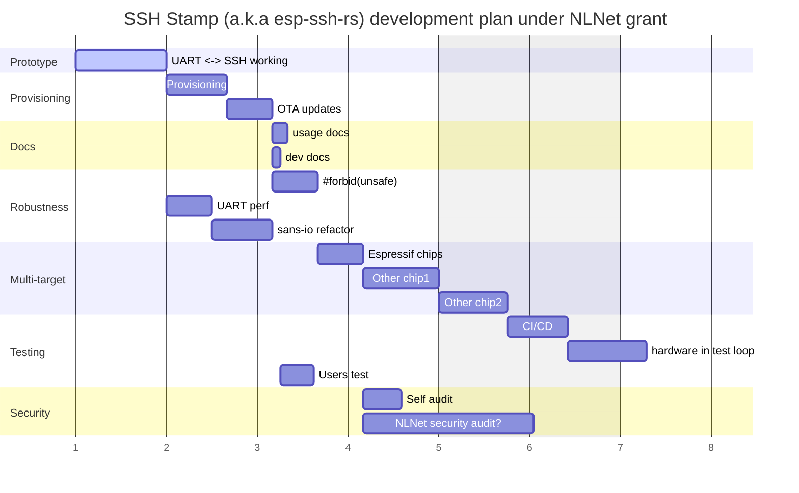

```verbatim
Total hours: 200h
Hourly rate: 40 eur/h
```

<!--
Original email snippet about cost estimates (as sent to NLNet on 2025-03-03)

 1. To have a WiFi AP/STA device that a user can SSH into and securely manage any other device with an UART.
    1.1 Prototype cost me (out of pocket) around 500€, needs more refinement, so probably should cost no more than 900€ at this point.

2. The device should be relatively effortless to deploy and provision with the required secret key material.
    2.1 Challenging as there are as many ways to onboard devices as opinions about it. But applying simplicity and involving third parties in testing, I'd budget this at an additional 800€.

3. Written in embedded Rust (ideally no_std and no alloc to reduce memory fragmentation and allow long runtimes without memory issues).
    3.1 Many of the unsafe issues have been circumvented, but way more work is needed to make this robust.
    3.2 Espressif UART-DMA serial driver vs Interrupt driver: Implementing the most suitable solution that does not overrun or glitch the UART (has happened), ~700€
    3.3 Porting to as many Espressif targets as possible, taking care of memory requirements and setting up HIL (Hardware In the Loop) testing jigs: ~800€
    3.4 [Sans-IO refactor][sans-io]: The current prototype needs a cleaner decoupling of finite state machines and IO, but a careful focus on performance, ~1500€
    3.5 Run SSH audit with specialised tools such as SSHambles by HDmoore et al: 300€

TOTAL: 5000€ (wrong estimate!?)
-->