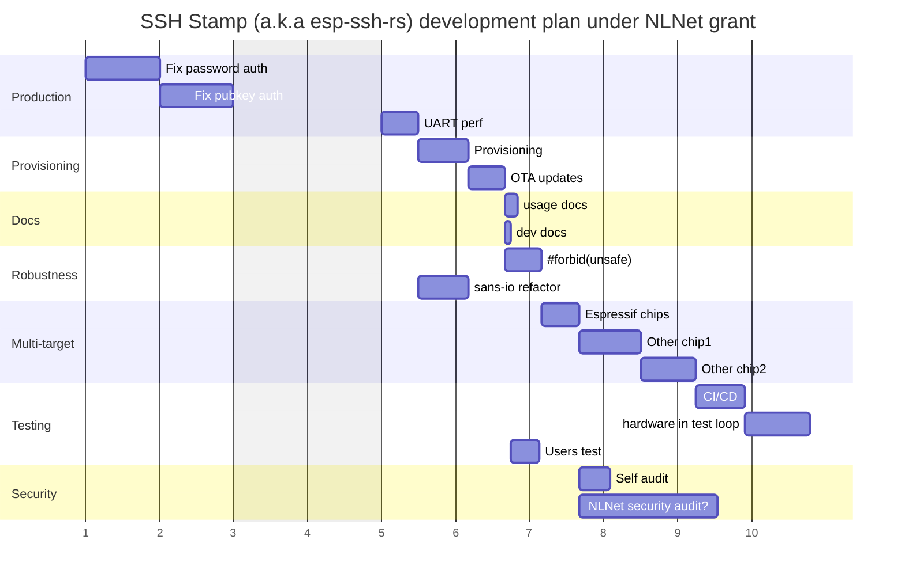

```mermaid
gantt
    title SSH Stamp (a.k.a esp-ssh-rs) development plan under NLNet grant
    dateFormat YYYY-MM-DD
    excludes weekends
    tickInterval 1day
    weekday monday
    todayMarker off
    axisFormat %e
    section Production 
        Fix password auth       :      passwd, 2025-05-01, 24h
        Fix pubkey auth         :      pubkey, after passwd, 24h
        UART perf               :      uart_intr, after pubkey, 12h
    section Provisioning
        Provisioning            :      prov, after uart_intr, 16h
        OTA updates             :      ota, after prov, 12h
    section Docs
        usage docs              :      usage_docs, after ota, 4h
        dev docs                :      dev_docs, after ota, 2h
    section Robustness
        #forbid(unsafe)         :      no_unsafe, after ota, 12h
        sans-io refactor        :      sans_io, after uart_intr, 16h
    section Multi-target
        Espressif chips         :      all_espressif, after no_unsafe, 12h
        Other chip1             :      chip1, after all_espressif, 20h
        Other chip2             :      chip2, after chip1, 18h
    section Testing
        CI/CD                   :      ci, after chip2, 16h
        hardware in test loop   :      HIL, after ci, 21h
        Users test              :      user_tests, after dev_docs, 9h
    section Security
        Self audit              :      self_sec_audit, after all_espressif, 10h
        NLNet security audit?   :      nlnet_sec_audit, after all_espressif, 45h
```
